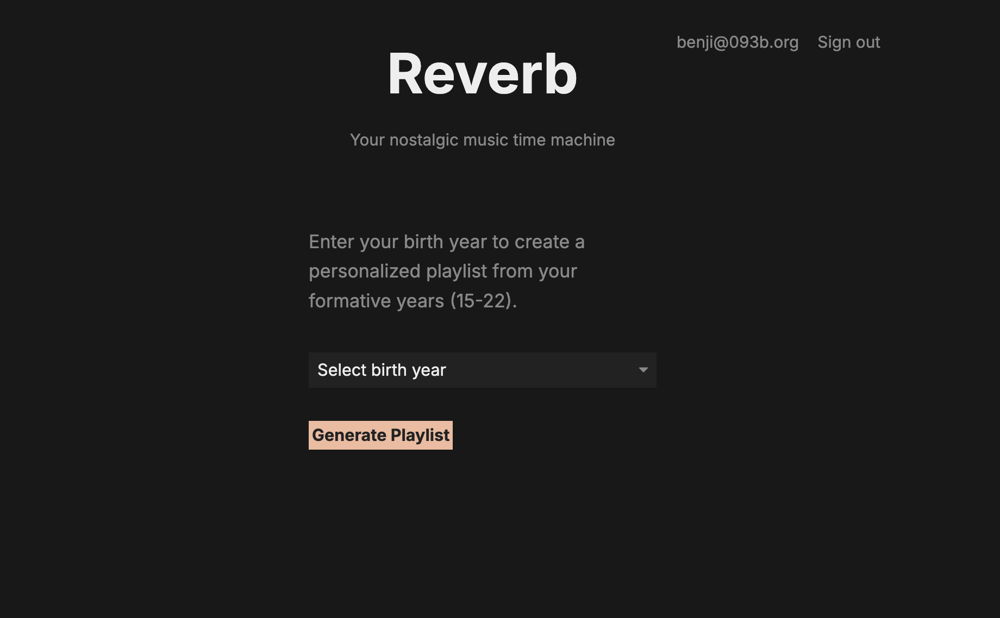

# Reverb: Nostalgia Playlist Generator 🎵

Generate personalized Spotify playlists based on the music that defined your formative years (ages 15-22). This app helps you rediscover the songs that shaped your musical taste during your most influential period.



Available at [https://reverb.093b.org](https://reverb.093b.org)

## Features

- Automatically creates Spotify playlists based on your birth year
- Focuses on your formative years (ages 15-22)

## Prerequisites

- Node.js (v14 or higher)
- A Spotify account
- Spotify Developer credentials

## Setup

1. Clone the repository:
   ```bash
   git clone https://github.com/yourusername/nostalgia-playlist-generator.git
   cd nostalgia-playlist-generator
   ```

2. Install dependencies:
   ```bash
   pnpm install
   ```

3. Create a `.env` file from the `.env.example` file:

## Usage

1. Start the application:
   ```bash
   pnpm dev
   ```

2. Open your browser and navigate to `http://localhost:3000`
3. Enter your birth year
4. Click "Generate Playlist"
5. Authorize with your Spotify account when prompted
6. Enjoy your personalized nostalgia playlist!

## How It Works

The app calculates your formative years (ages 15-22) based on your birth year and creates a playlist featuring popular songs from those years. For example, if you were born in 1990, it will generate a playlist with hits from 2005-2012.

## License

This project is licensed under the MIT License - see the [LICENSE](LICENSE) file for details.

